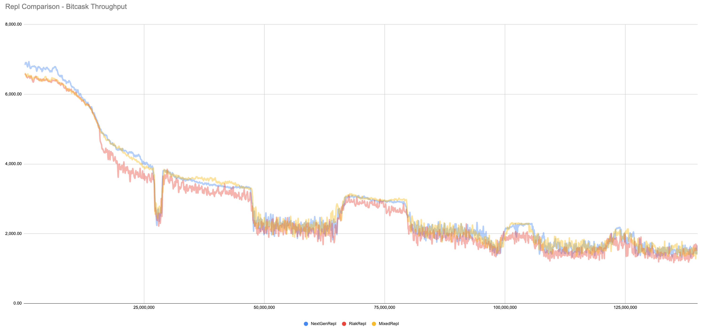

# Riak 2.9.1

## Volume Test Configuration

As the focus for 2.9.1 testing is on replication, the primary test has been completed on two 4-node clusters with bi-directional replication.  The server hosts have an excess of low-speed CPU cores, 96GB RAM, plus large spinning-HDD disks fronted by a RAID controller (RAID10) with a flash-backed write cache.

Nodes have been configured not to sync to disk on writes, and with a ring size of 128 vnodes.

The clusters are labelled active and passive - and reads/writes go into the active cluster only.  A new basho_bench PUT is used called `put_unique_checkrepl` that PUTs into an active site, and then polls the time it takes to read from the passive site.  The `put_unique_checkrepl` time can then be compared with the `put_unique` time to measure replication time.

```
{mode, max}.

{duration, 2880}.
{report_interval, 10}.
{node_name, testnode1}.

{concurrent, 100}.
{driver, basho_bench_driver_nhs}.

{key_generator, {eightytwenty_int, 100000000}}.

{value_generator, {semi_compressible, 8000, 2000, 10, 0.2}}.

{alwaysget, {800000, 400000, key_order}}.
{unique, {8000, skew_order}}.

{pb_ips, [ ... ]}.
{replpb_ips, [ ... ]}.
{http_ips, [ ... ]}.

{riakc_pb_replies, 1}.

{operations, [{alwaysget_pb, 460}, {alwaysget_updatewithout2i, 200},
                {put_unique, 148}, {put_unique_checkrepl, 2}, {get_unique, 190}]}.
```

The load profile of this test is impacted by the behaviour of `alwaysget_pb` which will not be triggered until there has been approximately 100M updates.  This means that the first part of the test is heavy PUT load, which builds up o(1TB) volume of data in each node.  Then when the trigger point is reached the load switches to a balance between GET and PUT load, with the majority of PUTs being updates to existing objects.

## Backend Comparison

This particular load profile is suited to the `leveled` backend.  

On bitcask, the combination of a lengthy test duration, some objects being large pre-compression, and a significant proportion of updates (rather than fresh inserts) - leads to performance hits during triggered compactions.  On leveldb, the write-amplification in the backend leads to excess disk utilisation and impaired throughput.

The comparison between backends of throughput graphed against aggregated PUT volume, shows this bias:


## Bitcask - Compare riak_repl to nextgenrepl

Testing with the bitcask backend, the test was run with three settings: `nextgenrepl` - for both full-sync and real-time replication; `riak_repl` - for both full-sync and real-time replication, and; `mixed_repl` - `nextgenrepl` full-sync and `riak_repl` real-time replication.

Focusing on throughput, the transactionr ates were similar for the `nextgenrepl` and `mixed_repl` tests, but **5.7%** lower in the `riak_repl` test:



There is a significant improvement in the replication time, and the volatility of the replication time with the `nextgenrepl` test compared to both the `mixed_repl` and `riak_repl` tests

This chart compares the PUT time against the PUT & CHECK_REPL time for `nextgenrepl`:

:

This is the equivalent chart for `riak_repl`:


This is the equivalent chart for `mixedrepl`:


The difference between the configurations, is highlighted by the increased READ volume on the disk system when running riak_repl with fullsync.  An extra 40MB/s of read throughput is required by node to run keylisting full-sync.


Test stats:

- On average, across the test, with `nextgenrepl` the time to PUT/REPL/GET was **14.18ms** greater than the PUT time - an increase of **16.7%** on the PUT time.

- On average, across the test, with `riak_repl` the time to PUT/REPL/GET was **97.79ms** greater than the PUT time - an increase of **111.9%** on the PUT time.

- When testing with `nextgenrepl` rather than `riak_repl` there was a **5.99%** increase in throughput across the test.

- With the `riak_repl` test, there is a continuous background full-sync operation running with the default configuration for concurrency.  At the closing data volume for  the test, each full-sync is taking > 24 hours to complete on the cluster.

- With the `nextgenrepl` test a full-sync is initiated and completed every 15 minutes.  There is a 2-orders of magnitude difference in the frequency of full-syncs possible when comparing the two replication mechanisms.

## Leveled - Compare riak_repl with nextgenrepl

Test stats:

- On average, across the test, with `nextgenrepl` the time to PUT/REPL/GET was **4.26ms** greater than the PUT time - an increase of **14.7%** on the PUT time.  

## Leveldb - Compare riak_repl with nextgenrepl

Test stats:

- On average, across the test, with `nextgenrepl` the time to PUT/REPL/GET was **3.70ms** greater than the PUT time - an increase of **5.0%** on the PUT time.

- On average, across the test, with `riak_repl` the time to PUT/REPL/GET was **4.60ms** greater than the PUT time - an increase of **6.1%** on the PUT time.

- When testing with `nextgenrepl` rather than `riak_repl` there was a **2.57%** increase in throughput across the test.

The small difference in throughput when switching repl is relatively hard to detect with a leveldb backend:


This chart compares the PUT time against the PUT & CHECK_REPL time for `riak_repl`:


This is the equivalent chart for `nextgenrepl`:


